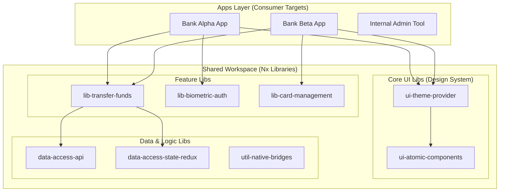

# Architecture Design: Multi-Tenant White-Label Banking Platform
**Stack:** Nx Monorepo, Expo (Bare Workflow), React Native, TypeScript, Redux-Persist

## 1. Executive Summary
This architecture is designed to support a **White-Label Mobile Banking Solution**. The primary objective is to maintain a single core codebase while deploying multiple, uniquely branded banking applications (Tenants). By leveraging an **Nx Monorepo**, we achieve a 500% reduction in code duplication through a strict "Library-First" approach.

---

## 2. High-Level System Diagram



---

## 3. Core Architectural Pillars

### A. Multi-Tenancy via Dependency Injection
To handle white-labeling, we avoid `if/else` statements for branding. Instead, we use a **Static Injection** pattern at the build level.
* **Tenant Configs:** Each app entry point imports a specific `theme.json` and `feature-flags.ts`.
* **Asset Buffering:** Shared components pull assets (logos/icons) from a `ResourceResolver` that maps to the specific tenant's assets folder during the Expo build process.

### B. Scalable State Management (Offline-First)
Banking apps require extreme reliability in low-connectivity areas.
* **Redux Toolkit:** Used for predictable state transitions.
* **Redux-Persist:** Configured with a native disk-level encryption layer to ensure sensitive financial data is stored securely.
* **Optimistic UI:** Transactions are reflected instantly in the UI, with background reconciliation handled via a robust queuing system.

### C. The "Native" Performance Bridge
For performance-critical tasks (Biometrics, Secure Enclave interactions, or complex animations), we utilize the **Expo Bare Workflow**.
* **Custom Native Modules:** High-frequency logic is written in **Swift (iOS)** and **Kotlin (Android)**.
* **JSI (JavaScript Interface):** Used for low-latency communication between the JS thread and the Native rendering engine, ensuring 60 FPS interactions.

---

## 4. Repository Structure (Nx)

```text
apps/
  ├── bank-alpha/           # Consumer App 1 (Expo Bare)
  ├── bank-beta/            # Consumer App 2 (Expo Bare)
libs/
  ├── shared/
  │   ├── ui/               # Atomic Design System (Buttons, Inputs)
  │   ├── state/            # Redux Slices & Middleware
  │   ├── api/              # gRPC / REST Service Layers
  ├── features/
  │   ├── payments/         # Encapsulated Transfer Logic
  │   ├── onboarding/       # KYC & Identity Verification
  ├── tools/
  │   ├── native-utils/     # Custom Swift/Kotlin Bridges
```

---

## 5. Deployment & CI/CD Pipeline
To manage multiple apps efficiently, the CI/CD utilizes **Nx Affected** commands:
1.  **Code Change:** A developer modifies the `shared/ui` library.
2.  **Nx Affected:** The CI identifies that *all* banking apps are affected.
3.  **Parallel Build:** GitHub Actions triggers parallel builds for Bank Alpha and Bank Beta using **EAS (Expo Application Services)**.
4.  **Automated Testing:** Jest unit tests and React Native Testing Library suites are executed with **GitHub Copilot-generated** test scaffolding for 100% coverage on critical paths.

---

## 6. Security & Compliance
* **SSL Pinning:** Implemented at the native level to prevent Man-in-the-Middle (MitM) attacks.
* **Secure Storage:** Using `expo-secure-store` for keychain/keystore management of JWTs.
* **Obfuscation:** ProGuard (Android) and DexGuard configurations integrated into the build pipeline to prevent reverse engineering.


